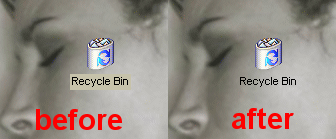



## Make desktop icon text background transparent\!

### Description

Ever wanted to make the butt ugly block of colour behind desktop icon's text disappear through code? well, now you can! I searched the net hi and low for VB code to do this but to no avail, so I wrote this. To my knowledge it's the FIRST EVER VB code for this, so check it out. It's only been tested on Win 9x & Win ME. Take a peek at my site at http://www.em.f2s.com if you like this code. Hope you learn something =)
 
### More Info
 

             |
---                |---
**Submitted On**   |2000-08-22 13:36:46
**By**             |[em ](https://github.com/Planet-Source-Code/PSCIndex/blob/master/ByAuthor/em.md)
**Level**          |Intermediate
**User Rating**    |4.9 (117 globes from 24 users)
**Compatibility**  |VB 5\.0, VB 6\.0
**Category**       |[Miscellaneous](https://github.com/Planet-Source-Code/PSCIndex/blob/master/ByCategory/miscellaneous__1-1.md)
**World**          |[Visual Basic](https://github.com/Planet-Source-Code/PSCIndex/blob/master/ByWorld/visual-basic.md)
**Archive File**   |[CODE\_UPLOAD91948222000\.zip](https://github.com/Planet-Source-Code/em-make-desktop-icon-text-background-transparent__1-10892/archive/master.zip)

